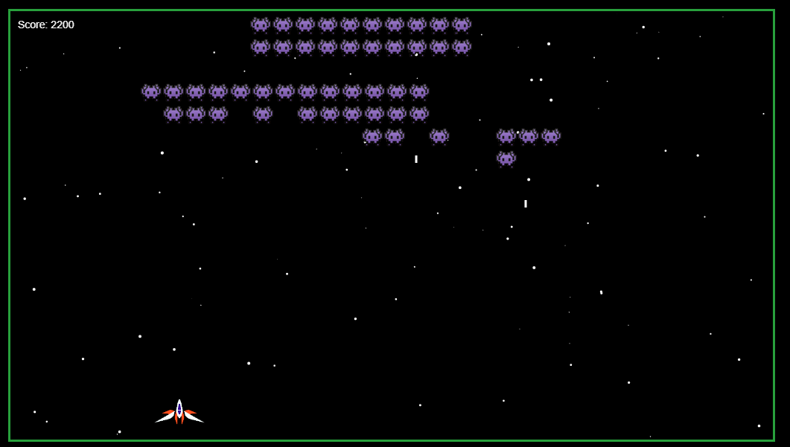

# Space Invaders :space_invader:
Projeto do jogo Space Invaders, clássico da década de 80.

O jogo consiste de uma nave para o jogador, ele pode atirar nos invasores e os invasores podem atirar de volta.

Os invasores são criados em um intervalo de tempo variável.

O resultado pode ser visto [aqui](https://andreibuslik.github.io/Space-Invaders/).

###  :construction:  ToDo: :construction:

--------

- Labels dinâmicas para a pontuação
- Bombas
- Power-Ups
- Aumento progressivo da dificuldade
- Animações no sprite da nave
- Interfaçe com usuário para iniciar/reiniciar o jogo
- Tela de fim de jogo
- Efeitos sonoros
